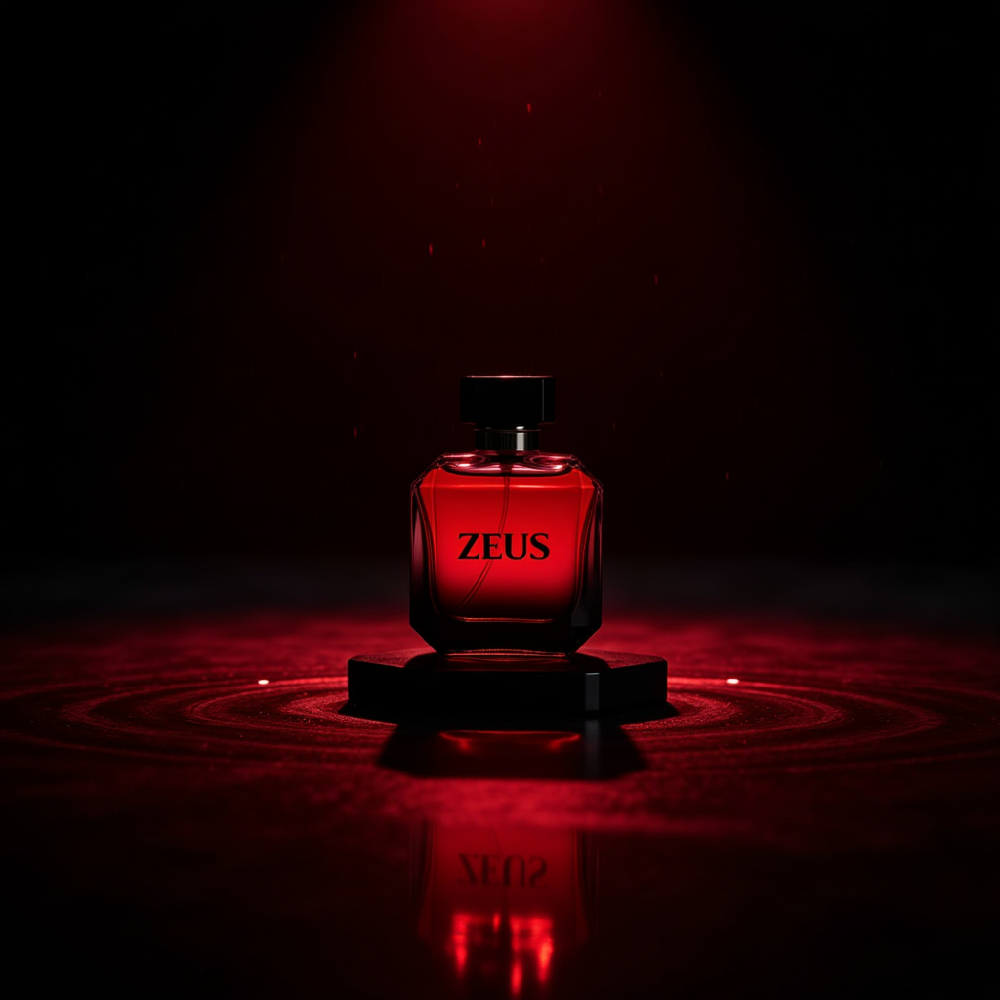

<div align="center">

# 📸 AI Product Photography with Custom LoRA — FLUX.1 Dev

**Studio-quality product photography generated entirely with AI — no camera, no studio, no photographer.**

[](https://github.com/comfyanonymous/ComfyUI)
[](https://blackforestlabs.ai)
[](https://huggingface.co/docs/diffusers/training/lora)
[]()

</div>

---

## What is this?

This project demonstrates how to generate **photorealistic product photography** using a custom LoRA trained on **100% AI-generated synthetic images** — no real photos were used at any stage. The LoRA was trained on FLUX.1 Dev and can place the product in any environment with stunning realism.

> Every single training image was synthetically generated using AI. The LoRA learned the product purely from artificial data — and the results are indistinguishable from real photography.

---

## Results

| Dark Studio — Dramatic Red Lighting | Golden Hour — Rooftop |
|---|---|
|  |  |

| Ancient Stone — Outdoor Natural Light | Warm Amber — Luxury Interior |
|---|---|
|  |  |

---

## Pipeline Overview

```
Synthetic Image Generation
         ↓
  LoRA Training on FLUX.1 Dev
         ↓
  ComfyUI Workflow Assembly
         ↓
  Product Photography Generation
```

---

## Step 1 — Synthetic Training Data

Instead of photographing a real product, **all training images were generated using AI**. This approach:

- Removes the need for a physical product during training
- Allows full control over lighting, angles, and backgrounds
- Produces consistent, clean training data with no real-world noise

The synthetic images were generated with varied backgrounds, lighting conditions, and camera angles to give the LoRA enough diversity to generalize well.

---

## Step 2 — LoRA Training on FLUX.1 Dev

The LoRA was trained on top of **FLUX.1 Dev** — one of the most capable open-source image generation models available. FLUX.1 Dev uses a **transformer-based diffusion architecture** (not UNet), which enables superior prompt following and photorealistic detail.

| Training Detail | Value |
|---|---|
| Base Model | FLUX.1 Dev (`flux1-dev.safetensors`) |
| LoRA Output | `product-lora.safetensors` |
| Training Data | 100% AI-generated synthetic images |
| LoRA Strength | 1.0 (full weight at inference) |

---

## Step 3 — ComfyUI Workflow

The inference workflow was built in **ComfyUI v1.23.4** and consists of the following nodes:

### Models Used

| Component | Model | Node |
|---|---|---|
| **Diffusion Model** | `flux1-dev.safetensors` | `UNETLoader` |
| **Text Encoder 1** | `clip_l.safetensors` | `DualCLIPLoader` |
| **Text Encoder 2** | `t5xxl_fp16.safetensors` | `DualCLIPLoader` |
| **VAE** | `ae.safetensors` | `VAELoader` |
| **LoRA** | `product-lora.safetensors` | `LoraLoaderModelOnly` |

### Workflow Node Chain

```
UNETLoader (flux1-dev)
       ↓
LoraLoaderModelOnly (product-lora, strength=1.0)
       ↓
KSampler ←── FluxGuidance (cfg=3.5)
    ↑              ↑
EmptyLatent    CLIPTextEncode (positive prompt)
(1024×1024)    CLIPTextEncode (negative prompt)
       ↓
   VAEDecode (ae.safetensors)
       ↓
  PreviewImage
```

### KSampler Settings

| Parameter | Value |
|---|---|
| Steps | 20 |
| CFG Scale | 1.0 (with FluxGuidance = 3.5) |
| Sampler | Euler |
| Scheduler | Simple |
| Denoise | 1.0 |
| Resolution | 1024 × 1024 |

### Why DualCLIPLoader?

FLUX.1 uses **two text encoders** simultaneously:
- `clip_l` — handles short, structured prompts (CLIP-style)
- `t5xxl_fp16` — handles long, detailed natural language prompts (T5-style)

Both encoders work together to give FLUX.1 its exceptional prompt adherence.

### Why FluxGuidance instead of CFG?

FLUX.1 Dev uses **FluxGuidance** (set to `3.5`) instead of the traditional Classifier-Free Guidance scale. This is specific to the FLUX architecture and produces sharper, more prompt-accurate results than standard CFG.

---

## Sample Prompt Used

```
a man holding zeus using it wearing black suit in bedroom
shot with good lighting shot in alex arria style
```

The LoRA handles the product consistency — the prompt only needs to describe the scene, environment, and style.

---

## Key Takeaways

- **Zero real photos used** — training data was 100% synthetically generated
- **FLUX.1 Dev** produces significantly better results than SD 1.5 or SDXL for product photography
- **Dual text encoders** (CLIP-L + T5-XXL) enable precise prompt control
- **LoRA at strength 1.0** perfectly preserves product identity across any scene
- Same product, infinite environments — just change the prompt

---

## Use Cases

- E-commerce product listings
- Social media marketing content
- Brand mood boards and concept visualization
- Ad campaign mockups
- Rapid prototyping for packaging design

---

## Demo

🎬 [Watch the full workflow walkthrough](./Creating%20Realistic%20Product%20Photography%20with%20Custom%20LoRa%20in%20Confi%20UI%20-%20Copy.mp4)

📋 [ComfyUI Workflow JSON](./ProductLoRA_Workflow.json)

---

## License

MIT — free to fork and build on.
